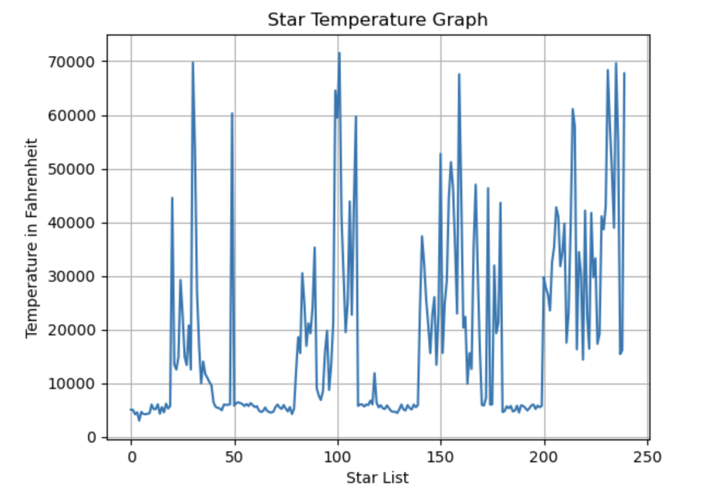

# Star Classifying

I classified and graphed stars in Python using a real world data set. 

This is a repository for the minimum working example of the KNearestNeighbors machine learning classification algorithm using a star dataset. 
Click [here](https://www.kaggle.com/datasets/deepu1109/star-dataset) for the link to it.

# Description

In the star dataset, there are 6 types of stars; Red Dwarf, Brown Dwarf, White Dwarf, Main Sequence, SuperGiants, and HyperGiants. There are also a 6 properties of stars; absolute temperature, relative luminosity, relative radius, absolute magnitude, star color, and spectral class. 

# Issue

Before I could start classifying the star dataset, I had an issue. Two of the properties (Star color and spectral class) in the dataset were strings, not numbers! This is a problem, because ML (machine learning) algorithms can only take numbers. They will give an error if you give them letters. So, I had to use **Ordinal Encoder**. This is a data transformer that is from Scikitlearn that turns letters and words from human language into numbers. Something that can be noted about this Ordinal Encoder is that the process in which you use it is surprisingly similar to how Scikitlearn ML algorithms like KNearestNeighbors are used.

# Experiments

After I fixed the star dataset, I classified the it in three steps. First I split the data, using Scikit-learn. Then, I graphed the split data, using Matplotlib. Finally, I trained my data on KNearestNeighbors, using Scikit-learn, to predict the type of star. This allows me to show the star dataset in a visual way, while practicing my machine learning skills. 

# Graphs of the Iris dataset
## Star Tempurature 

# Analysis

The KNearestNeighbors algorithm was being really inaccurate (30-60%), so I tried to fix it by lowering the amount of neighbors it was comparing itself to. When I lowered it to one, it got answers that were 40-80% accurate, but still not perfect

# Conclusion 

In conclusion, I feel like graphing stars using a real world dataset was quite fun. However, I am going to have to work on finding a better algorithm that uses neural networks next time.
